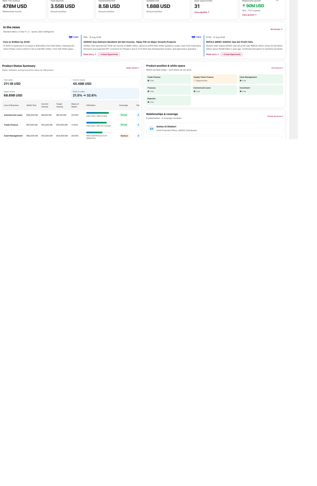
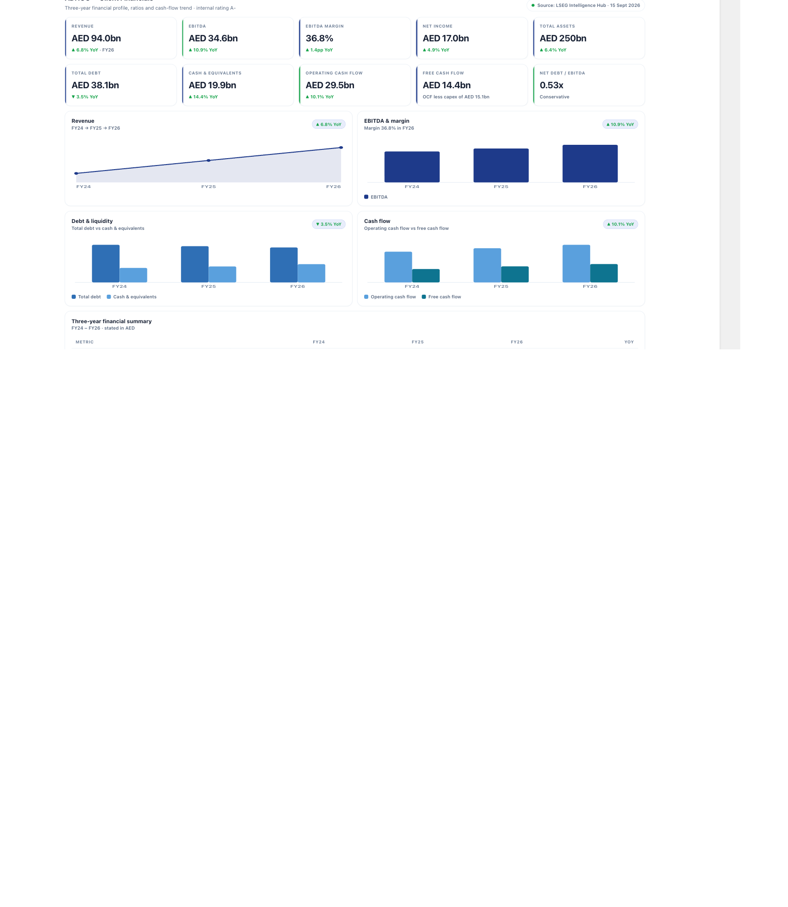
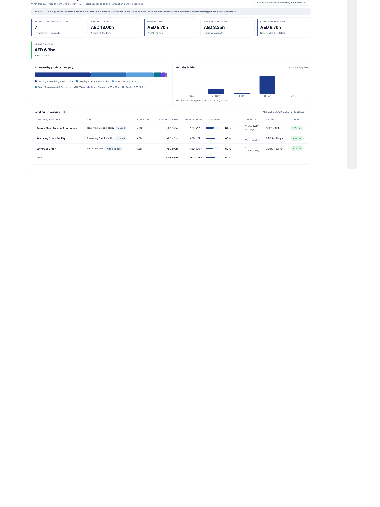
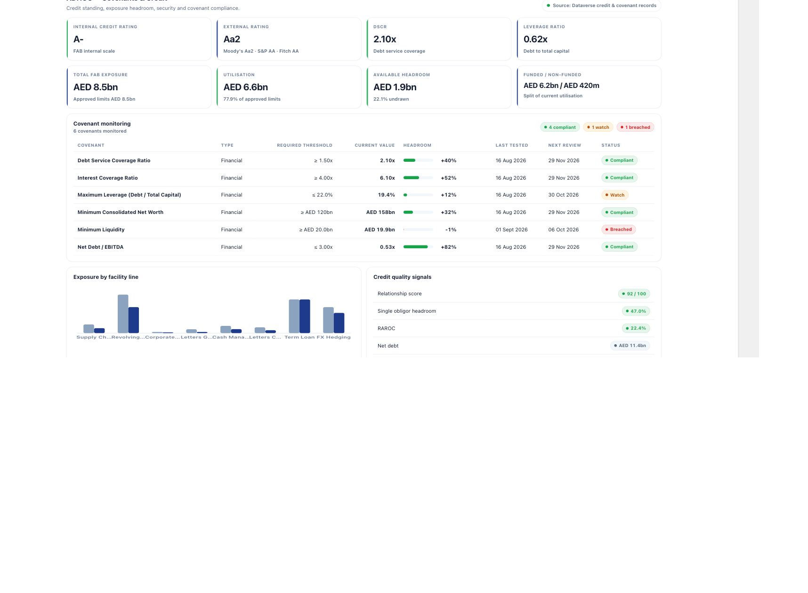
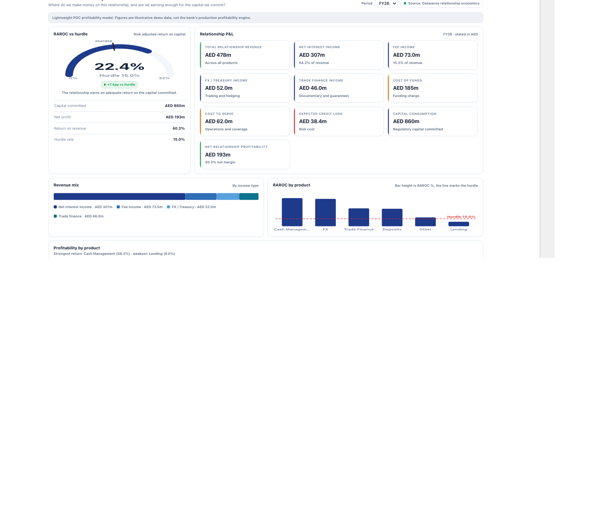
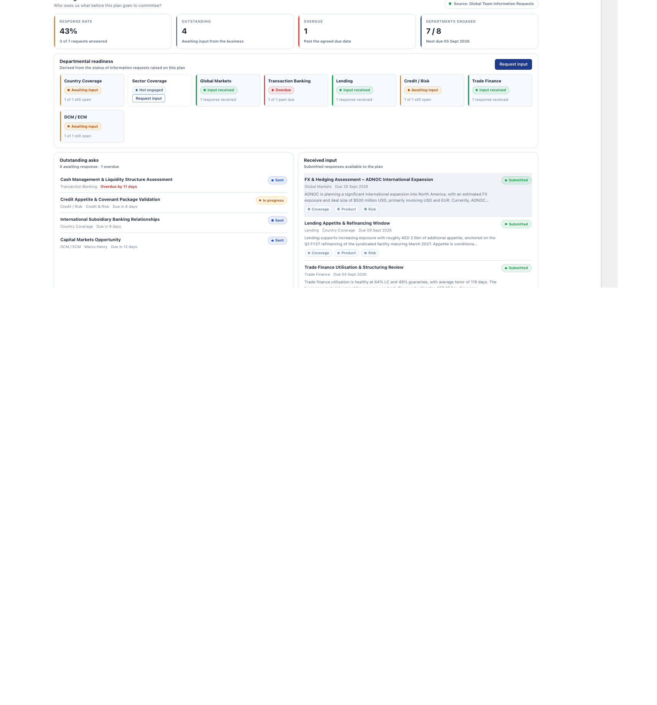

# Corporate Banking – Account Planning for Dynamics 365

A model-driven **Account Planning** solution for corporate / wholesale banking, built on Dataverse and Dynamics 365 Sales.

The Account Plan is a single record surfaced through a **19-tab form**, where most tabs are custom HTML web resources rather than standard Dataverse grids — giving a dashboard-style experience closer to a modern banking front-office application.

> This solution was built as a demonstration asset. Sample screens use fictional corporate group data and demo email domains.

---

## What's inside

| Area | Tabs |
|---|---|
| **Client** | Account Plan Summary, Business Background, Group Hierarchy & UBO, Client Financials |
| **Relationship** | Products & Holdings, Share of Wallet, Limits & Utilisation, Relationship Economics, Pricing |
| **Risk** | Covenants & Credit, Risk Register, SWOT |
| **Execution** | Sales Pipeline, Stakeholder Management, Coverage Team Collaboration, Global Team Inputs, Service & Complaints, Timeline, Settings |

### Component summary

| Component type | Count |
|---|---|
| Tables (13 custom + 5 extended OOB) | 18 |
| Columns on OOB tables | 52 |
| Web resources (HTML + JS) | 21 |
| Model-driven app + site map | 2 |
| Business process flow + cloud flow | 2 |
| PCF control (`PipelineDealTracker`) | 1 |
| Global option set (`fsi_tenor`) | 1 |
| Environment variables | 4 |
| **Total** | **109** |

**Custom tables:** `fsi_accountplanning`, `fsi_borrowerentity`, `fsi_companyfinancial`, `fsi_coverageteammember`, `fsi_crosssellproduct`, `fsi_deposit`, `fsi_facility`, `fsi_informationrequest`, `fsi_informationrequesttemplate`, `fsi_limitsandutilization`, `fsi_relationshipeconomics`, `fsi_shareofwallet`, `fsi_stakeholdercoverage`, `cr640_covenant`

**Extended OOB tables:** `account` (28 columns), `contact` (6), `opportunity` (4), plus `incident` and `lead` referenced read-only.

---

## Screens

All screenshots are of the running solution using the bundled demo dataset.

### Account Plan Summary
Relationship direction, revenue and EBITDA, limit utilisation, wallet share and next actions.



### Group Hierarchy & UBO
Pan/zoom legal-entity tree driven from Dataverse — ownership percentages, ultimate beneficial owner, country, entity type, and FAB-client vs non-client status. Click any entity for a detail card.


### Client Financials
Three-year financial view — revenue, EBITDA, margin, leverage and cash-flow trends with YoY movement.



### Products & Holdings
Current product estate with the client: accounts, deposits, lending, trade finance and cash management, plus cross-sell whitespace.



### Covenants & Credit
Covenant register with headroom, test dates and breach status, alongside facility and collateral detail.



### Service & Complaints
Service quality and complaint history for the relationship.


### Relationship Economics
Revenue, cost, capital consumption and returns by product line.



### Coverage Team Collaboration
Departmental readiness and structured information requests across the global coverage team.



---

## Prerequisites

The target environment must have these installed **before** import:

| Requirement | Why |
|---|---|
| **Dynamics 365 Sales** | `opportunity`, sales dashboards, Kanban / Deal Manager PCF controls |
| **Dynamics 365 Customer Service** | `incident` — used by the Service & Complaints tab |
| **Lead Management** | `lead` reference in the app site map |

These are standard first-party solutions and Dataverse resolves them automatically during import.

### Optional — collateral data

The **Covenants & Credit** tab can display collateral records from `msfsi_collateral`, which ships with **Microsoft Cloud for Financial Services** (`FinancialServicesCommonAccelerator`).

That table is a **managed Microsoft component and cannot be redistributed inside this solution**, so it is deliberately excluded. If it is absent the tab degrades gracefully and shows *"No collateral records are held for this borrower."* — everything else on the tab works normally.

To enable it, install the Financial Services accelerator from Microsoft:
<https://learn.microsoft.com/en-us/dynamics365/industry/financial-services/>

---

## Installation

> **Verified:** the managed zip in this repository has been import-tested end to end into a clean Dynamics 365 trial environment — it completed with no errors, and all 14 tables, 7 tab web resources, the model-driven app and all 19 form tabs were confirmed present afterwards.

1. Download `solution/CorporateAccountPlanning_managed.zip` (recommended) or the unmanaged zip for further development.
2. In [Power Apps](https://make.powerapps.com) → **Solutions** → **Import solution**.
3. Select the zip and complete the wizard.
4. **Set the environment variables** (below) — required for AI features.
5. Publish all customisations.

### Environment variables

Values are intentionally **not** shipped. Set these after import under **Solutions → Corporate Banking – Account Planning → Environment variables**:

| Variable | Description |
|---|---|
| `fsi_AoaiEndpoint` | Azure OpenAI chat completions URL, e.g. `https://<resource>.openai.azure.com/openai/deployments/<deployment>/chat/completions?api-version=2024-10-21` |
| `fsi_AoaiTenantId` | Entra tenant id the flow authenticates against |
| `fsi_AoaiClientId` | Entra application (client) id with **Cognitive Services User** on the Azure OpenAI resource |
| `fsi_AoaiClientSecret` | Client secret for that app registration |

These drive the **Global Team Inputs AI service** flow, which summarises and rewrites contributions from coverage teams.

> **Leave them blank to disable AI features** — the rest of the solution works without them. For production, back the secret with **Azure Key Vault** rather than a plain environment variable.

No credentials of any kind are included in this repository.

---

## Notes for implementers

**Publisher prefixes.** Most components use the `fsi` prefix. One table — `cr640_covenant` — uses the source environment's default prefix. This is intentional and preserved deliberately: renaming it would break existing form, view and script references. It imports cleanly as-is.

**Web resources.** The HTML tabs are self-contained (inline CSS/JS, no external CDN calls) and query Dataverse through the Web API using the parent form context. They read the Account Plan record id from the form and resolve the related account from there. Deep links are built relative to the current organisation, so the solution is portable across environments.

**Demo branding.** Screens contain branding and sample content from the original demonstration, including fictional corporate group hierarchies and `@bankfabdemo.com` sample addresses. No real customer data, real email addresses or production endpoints are present.

**Cloud flow.** `GTI - Information Request AI Service` is HTTP-triggered and has **no connection references**, so import will not prompt for connections. After import, copy its HTTP trigger URL into the `__CONFIG__` row of `fsi_informationrequesttemplate` (field `fsi_formjson`, key `aiEndpoint`) to activate AI summarisation.

---

## Demo data

The solution ships **schema only** — no records. To populate a demo dataset, use the
one-click seeder in `tools/demo-data-seeder.html`.

It creates a fictional corporate group ("ADNOC" — illustrative demo data, not the real
company) spanning the account, the account plan and 13 related tables: group hierarchy,
financials, facilities, deposits, covenants, stakeholders, coverage team, and more.

**To use it**, upload it as an HTML web resource (for example `fsi_APDemoDataSeeder`),
publish, and open it from **Settings → Customisations → Web Resources**. It offers:

| Action | Behaviour |
|---|---|
| **Seed demo data** | Creates anything missing. Safe to re-run — existing records are skipped, not duplicated. |
| **Check status** | Read-only. Reports what is already present, scoped to the demo account. |
| **Remove demo data** | Deletes only the records it seeded, for that account. |

It runs entirely in the browser against the Web API using the signed-in user's
privileges, and needs no connections, flows or external services.

> Records are matched by name and scoped to the demo account, so the seeder will not
> touch data belonging to other customers in the environment.

---

## Repository layout

```
solution/     Importable managed and unmanaged solution zips
src/          Unpacked solution source for diffing and source control
tools/        Standalone demo data seeder (HTML web resource)
docs/images/  Screenshots
```

---

## Licence

Released under the [MIT Licence](LICENSE).

This is a community sample and is not an official Microsoft product. It is provided as-is, without warranty. Review and test it in a non-production environment before any production use.
